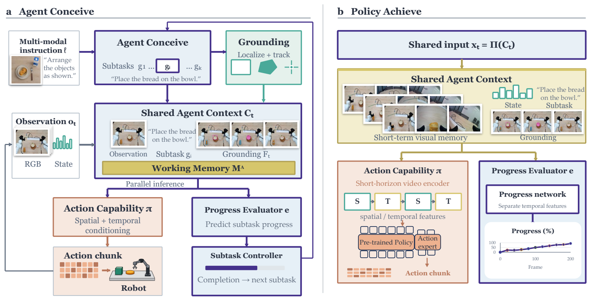
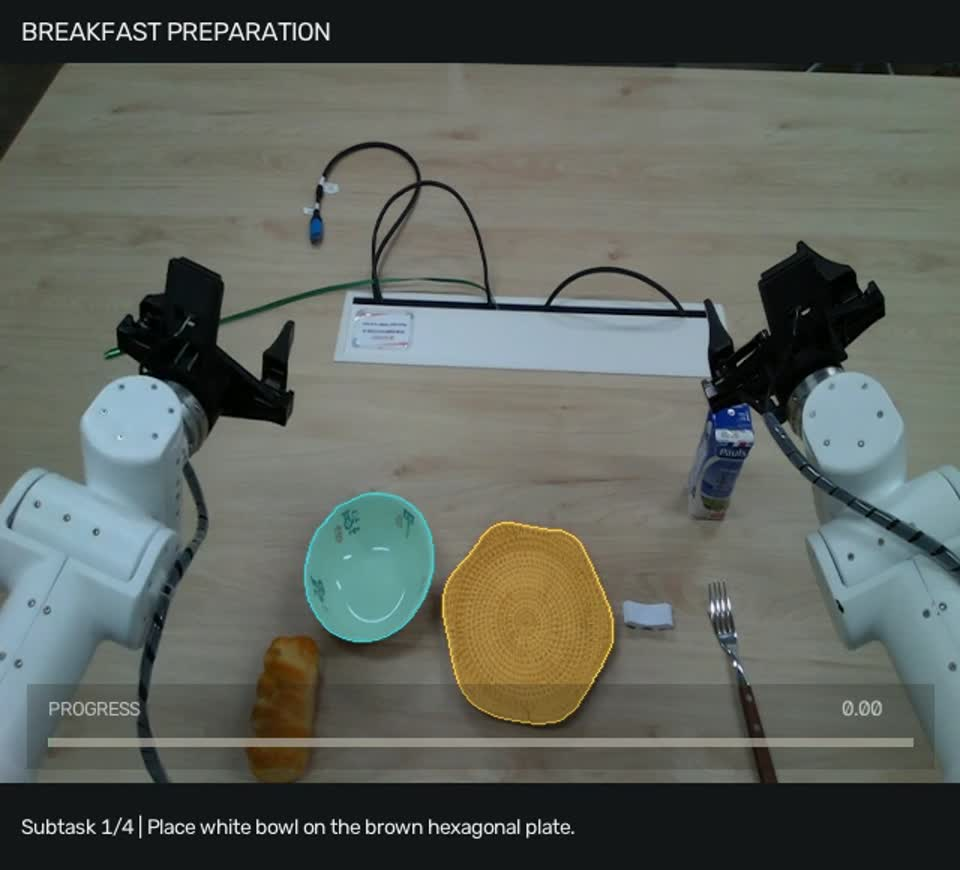
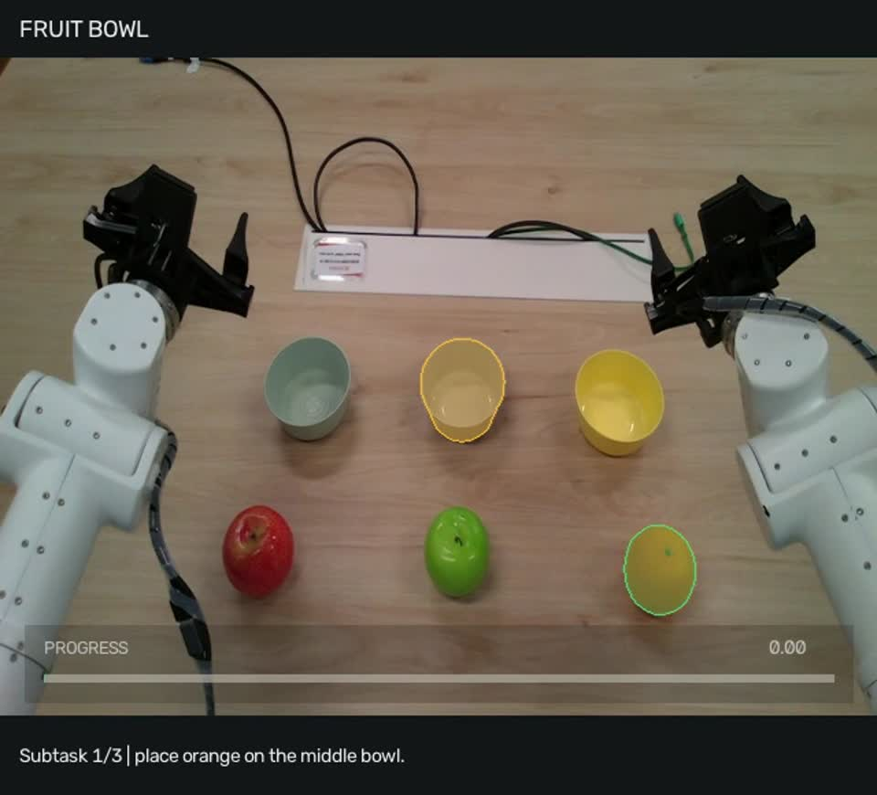
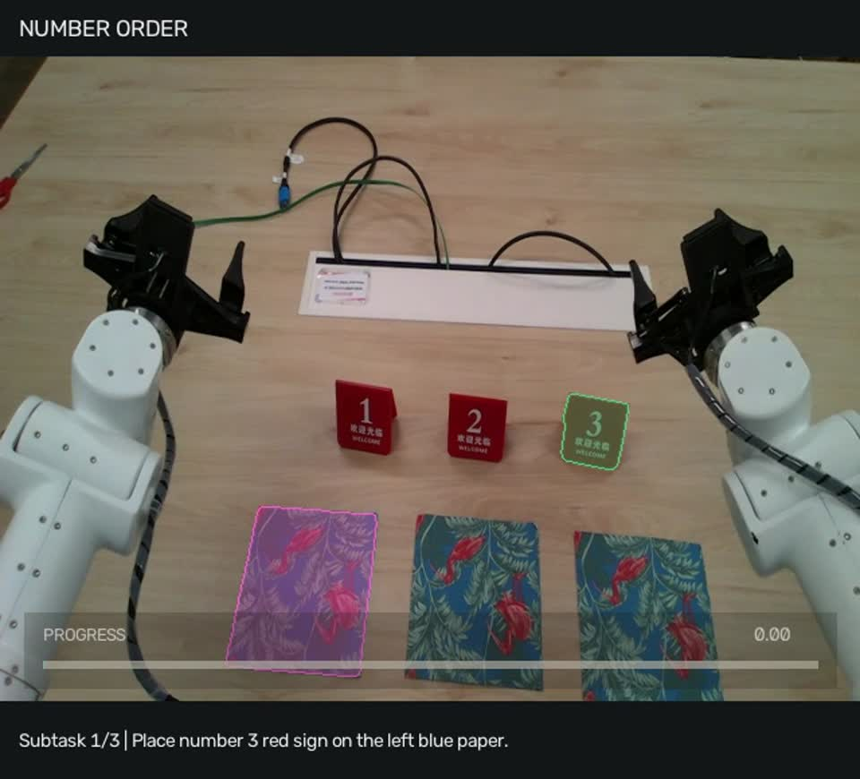
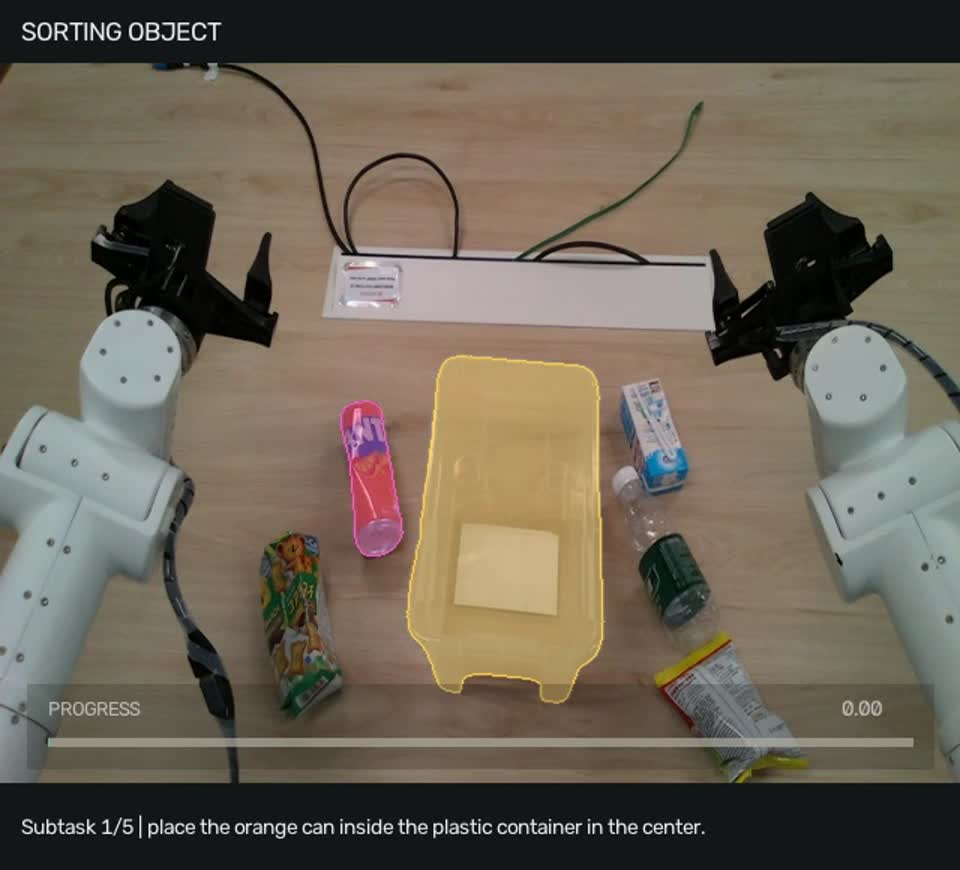
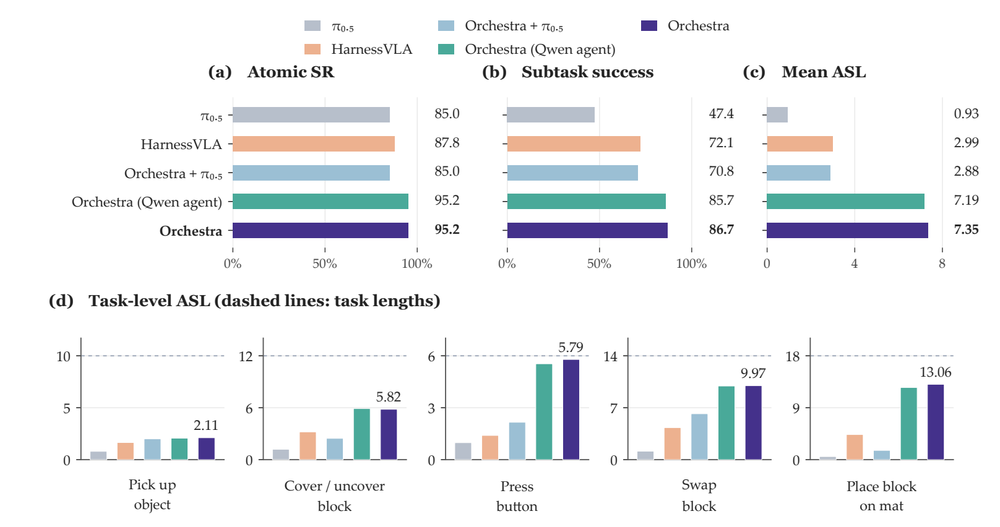
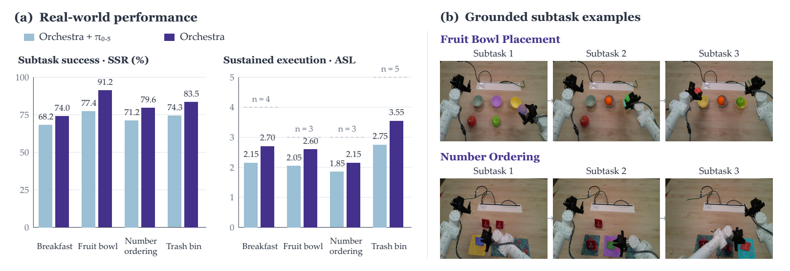

<div align="center">

# 🎼 Orchestra

### Let the Mind Conceive, Let the Hand Achieve
### Following Multimodal Instructions for Long-Horizon Robotic Manipulation

**Task planning · Visual grounding · Working memory · Progress-driven execution**

[Overview](#overview) · [Demos](#demos) · [Results](#results) · [Release Plan](#release-plan) · [Getting Started](#getting-started)

</div>

<br>



<p align="center"><em>Orchestra connects task-level reasoning and robot action through a shared execution context.</em></p>

<a id="overview"></a>

## 🧠 Overview

Following a long instruction requires a robot to remember what it has done, identify what to manipulate next, and decide when each step is complete. **Orchestra** brings these decisions together in an agent framework that coordinates planning, perception, and execution around an action policy.

The task agent converts a complete instruction into ordered subtasks and grounds the relevant objects in the scene. An adapted **π₀.₅** policy generates actions from the active subtask, spatial prompts, recent images, and robot state. A separately trained progress evaluator controls subtask transitions. The framework retains task records across the episode and refreshes local memory and grounding at each transition.

We evaluate Orchestra on **RMBench**, **RMBench-Compose**, and **four real-world manipulation tasks**. RMBench-Compose tests long-horizon composition after training on atomic skills and short trajectories.

| RMBench | RMBench-Compose | Real-world manipulation |
| :---: | :---: | :---: |
| **68.22%** mean success rate | **7.35** average success length | **2.75** average success length |
| **+26.22 percentage points** over Mem-0 | **2.46×** HarnessVLA | **+25.0%** over Orchestra with base π₀.₅ |

<a id="demos"></a>

## 🎬 Real-World Demos

Click a preview to watch the full demonstration. All videos play at **2× speed**.

| **Breakfast Preparation** · 4 subtasks | **Fruit Bowl Placement** · 3 subtasks |
| :---: | :---: |
| [](media/breakfast_preparation_demo_2x.mp4) | [](media/fruit_bowl_demo_2x.mp4) |
| [▶ Watch demonstration](media/breakfast_preparation_demo_2x.mp4) | [▶ Watch demonstration](media/fruit_bowl_demo_2x.mp4) |

| **Number Ordering** · 3 subtasks | **Trash Bin Placement** · 5 subtasks |
| :---: | :---: |
| [](media/number_order_demo_2x.mp4) | [](media/sorting_object_demo_2x.mp4) |
| [▶ Watch demonstration](media/number_order_demo_2x.mp4) | [▶ Watch demonstration](media/sorting_object_demo_2x.mp4) |

<a id="results"></a>

## 📊 Experimental Results

**Metrics.** Success rate measures task completion. Subtask Success Rate (SSR) measures success at the subtask level. Average Success Length (ASL) counts consecutive successful subtasks from the beginning of an episode.

### RMBench: memory-dependent manipulation

Across nine tasks, Orchestra achieves **68.22% mean success**, compared with **42.00%** for Mem-0 and **26.78%** for HarnessVLA.

| Method | Mean success rate |
| --- | ---: |
| π₀.₅ | 10.44% |
| MemoryVLA (QwenOFT) | 41.78% |
| Mem-0 | 42.00% |
| HarnessVLA (Codex) | 26.78% |
| **Orchestra** | **68.22%** |

<details>
<summary><strong>Full comparison across all nine tasks — Table 1</strong></summary>

| Method | Observe & Pick Up | Rearrange Blocks | Put Back Block | Swap Blocks | Swap T | Battery Try | Blocks Ranking Try | Cover Blocks | Press Button | Mean |
| --- | ---: | ---: | ---: | ---: | ---: | ---: | ---: | ---: | ---: | ---: |
| DP | 1% | 0% | 0% | 11% | **20%** | 10% | 10% | 0% | 0% | 5.78% |
| ACT | 1% | 29% | 0% | 2% | 2% | 19% | 0% | 0% | 0% | 5.89% |
| π₀.₅ | 9% | 13% | 11% | 24% | 15% | 16% | 6% | 0% | 0% | 10.44% |
| X-VLA | 9% | 13% | 18% | 16% | 3% | 26% | 1% | 2% | 0% | 9.78% |
| QwenOFT | 0% | 0% | 0% | 0% | 0% | 14% | 37% | 0% | 0% | 5.67% |
| MemER | 7% | 17% | 0% | 14% | 7% | 27% | 0% | 6% | 0% | 8.67% |
| Mem-0 | 4% | 89% | **90%** | 67% | 14% | 28% | 18% | 68% | 0% | 42.00% |
| MemoryVLA (OpenVLA) | 0% | 22% | 50% | 17% | 9% | 25% | 12% | 40% | 0% | 19.44% |
| MemoryVLA (QwenOFT) | 2% | 53% | 81% | 76% | 9% | **33%** | 53% | **69%** | 0% | 41.78% |
| HarnessVLA (Codex) | 10% | 32% | 62% | 18% | 5% | 24% | 20% | 26% | 44% | 26.78% |
| **Orchestra** | **81%** | **95%** | 81% | **86%** | 10% | 30% | **65%** | **69%** | **97%** | **68.22%** |

Best results in each column are shown in bold.

</details>

### RMBench-Compose: composition beyond the training horizon

RMBench-Compose spans **five environments** with **6–18 subtasks** per instruction. Policies train on atomic skills and short trajectories; evaluation requires completing longer sequences as object states change.



*Figure 3. Atomic skill success, compositional performance, and per-environment ASL. Dashed lines indicate task lengths.*

Orchestra reaches **7.350 ASL**, compared with **2.986** for HarnessVLA. Removing task orchestration, visual memory, or spatial grounding reduces mean ASL to **1.502**, **2.500**, and **5.814**, respectively.

<details>
<summary><strong>Component ablations by environment — Figure 4</strong></summary>

| Configuration | Pick up object | Cover / uncover block | Press button | Swap block | Place block on mat | Mean |
| --- | ---: | ---: | ---: | ---: | ---: | ---: |
| **Orchestra** | **2.11** | **5.82** | **5.79** | **9.97** | **13.06** | **7.350** |
| Without spatial grounding | 2.00 | 2.81 | 5.02 | 7.29 | 11.95 | 5.814 |
| Without visual memory | 1.69 | 2.47 | 1.28 | 4.87 | 2.19 | 2.500 |
| Without task orchestration | 1.07 | 1.89 | 1.20 | 2.30 | 1.05 | 1.502 |

All values are ASL.

</details>

### Real-world manipulation

We evaluate four tasks using **20 matched instructions per task and configuration**, totaling 80 rollouts per configuration. Instructions contain **3–5 subtasks**.



*Figure 5. Real-world performance and examples of object grounding across successive subtasks.*

| Task | Subtasks | ASL: Orchestra with base π₀.₅ | ASL: Orchestra |
| --- | :---: | ---: | ---: |
| Breakfast Preparation | 4 | 2.15 | **2.70** |
| Fruit Bowl Placement | 3 | 2.05 | **2.60** |
| Number Ordering | 3 | 1.85 | **2.15** |
| Trash Bin Placement | 5 | 2.75 | **3.55** |
| **Mean** | | **2.20** | **2.75** |

The spatially and temporally conditioned policy improves mean SSR from **72.77% to 82.09%** and mean ASL from **2.20 to 2.75**.

<a id="release-plan"></a>

## 📋 Release Plan

The **agent framework is available**. The annotation pipeline and mobile policy training/serving code are also available. Benchmark environments, the remaining evaluation code, and model checkpoints are next on the release plan.

- [x] Agent framework
- [ ] RMBench-Compose benchmark
- [ ] RMBench benchmark
- [x] Annotation pipeline
- [ ] Training code
- [ ] Evaluation code
- [ ] Model checkpoints

<a id="getting-started"></a>

## 🚀 Getting Started

With **Python 3.10+**, install from the repository root:

```bash
python -m pip install -e .
```

For mobile robot integration and an OpenAI-compatible task agent:

```bash
python -m pip install -e '.[mobile,openai]'
```

Mobile **action policy and progress evaluator training and serving code** is available
under [policy/modified_pi05](policy/modified_pi05/README.md). It includes only
`pi05_mobile_atomic_4task_short_horizon_memory_stride3` and
`pi05_mobile_atomic_4task_progress_evaluator_300m_stride3`, with their dependencies.
Datasets and checkpoints are separate releases.

The [MolmoPoint + SAM3 annotation pipeline](annotation/README.md) ([中文](annotation/README.zh-CN.md)) includes environment
setup, model server commands, batch annotation, and a review UI. See the
[agent pipeline guide](docs/agent-pipeline.md) ([中文](docs/agent-pipeline.zh-CN.md)) for how the same services
provide online grounding and tracking to the action policy and progress evaluator.
